# Tutorial - Part 2: Doors, Windows, and Cabinets

# Doors

By choosing **Exterior** or **Interior** in `[3. Part Selection]`, you will generate two separate components. These are designed to be embedded on either side of the doorway, joining together to form a complete door.

  

|   |   |
|---|---|
|Exterior/Front|Interior/Back|
|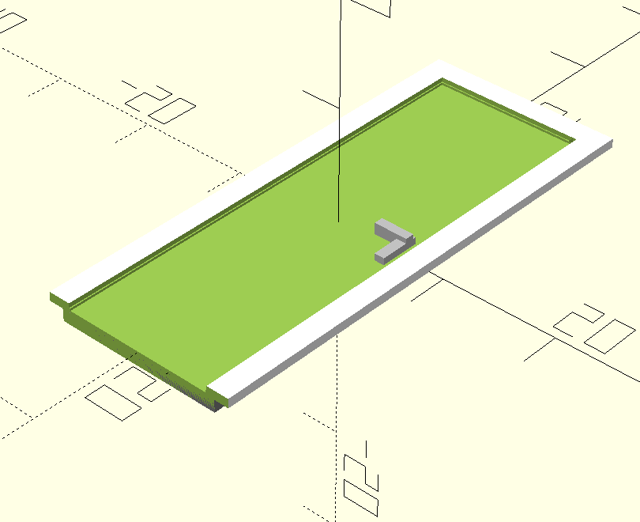|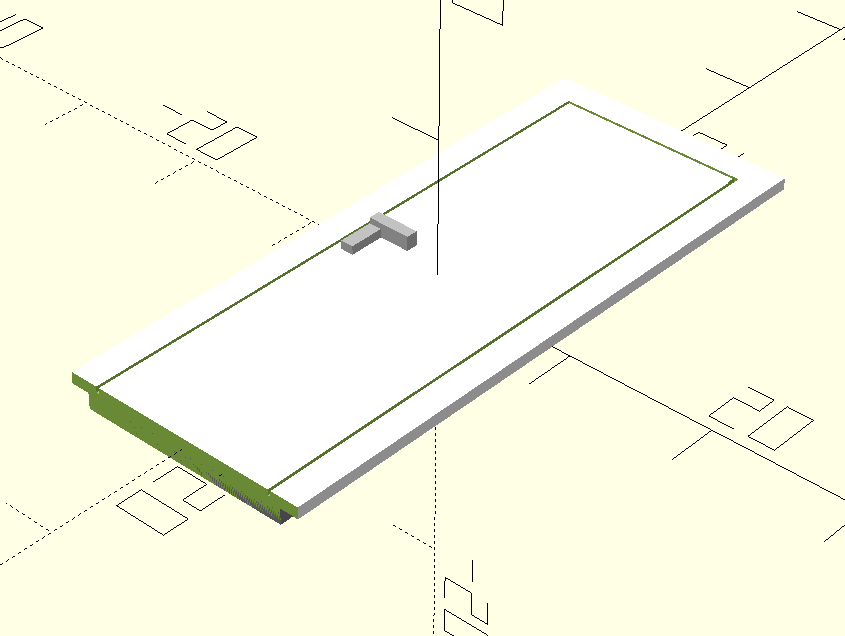|

To ensure the dimensions fit your doorway perfectly, focus on the following parameters:

|   |   |   |
|---|---|---|
|Group|参数|Description|
|1. Doorway Physical Dimensions (mm)]|door_w|Real-world **WALL OPENING** width (the hole in the wall).|
||door_h|Real-world **WALL** **OPENING** height.<br><br>> **💡 Tip:** If you have installed flooring, reduce `door_h` slightly (by the thickness of the floor) to prevent the door from being too tall to fit.|
||wall_t_real|Real-world **wall thickness**. Unlike the 'offset' parameter in the floor plan (which is half the thickness), this requires the **full thickness** (e.g., if the wall is 240mm, enter 240).|
|2. Scale and Tolerance|scale_f|Must match the `scale_f` value used in your `floor_plan`.|
||printer_tol|Controls printing tolerance. If the door is too tight for the opening at the default 0.2mm, increase this value.|

- **Door Handles**
    

The position of the simple door handles is controlled by these parameters:

- **`handing`****:** Sets the handle direction from the **Exterior** perspective. The interior handle will automatically mirror this to ensure they align when the door is assembled.
    
- **`handle_h_real`****:** The real-world height of the handle from the ground (mm).
    

  

- **Brim** **(Frame) Settings**
    

Group 5 parameters control the "brim" (the door frame). You can use the `remove` checkboxes to toggle the brim on different sides.

|   |   |
|---|---|
|With brim|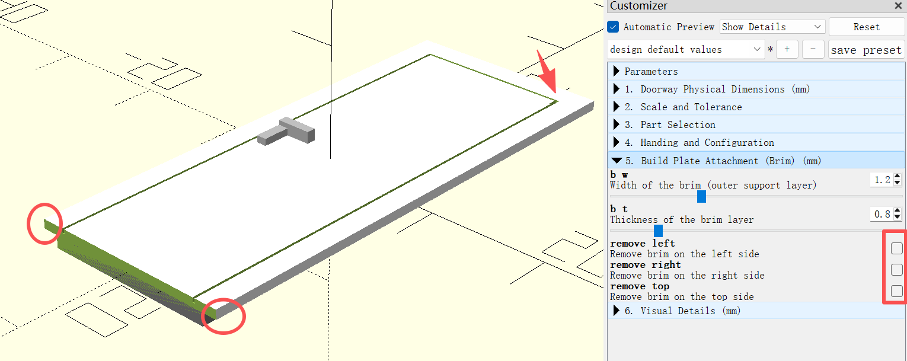|
|Without brim|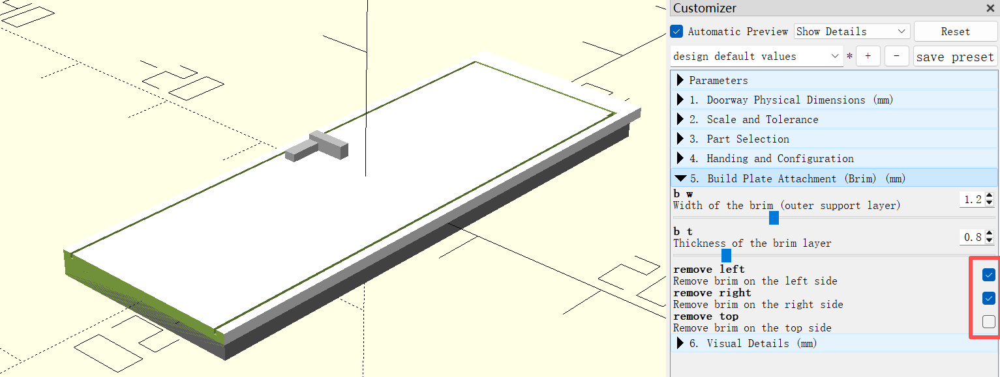|

**Recommendation:** Keep all brims for easier installation. If space is limited, keep at least the **top** brim.

The total thickness of the embedded parts is automatically calculated to equal the wall thickness minus `printer_tol`, regardless of brim settings.


- **Visual Details**
    
    - gap_d**:** Controls the depth of the decorative grooves on the door surface.
        
    
    |   |   |
    |---|---|
    |gap_d=0.4|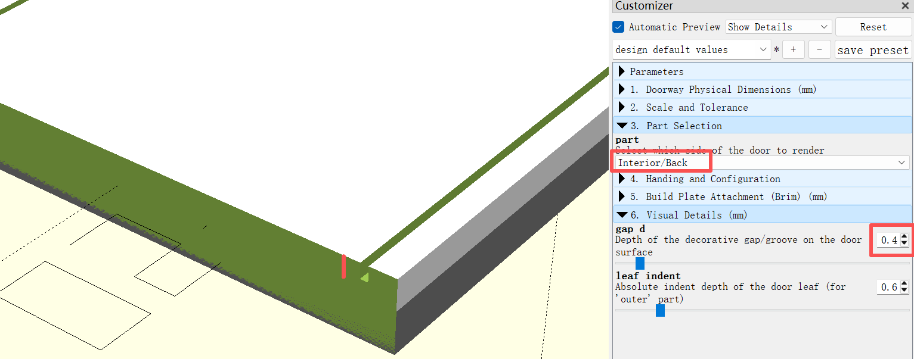|
    |gap_d=1.4|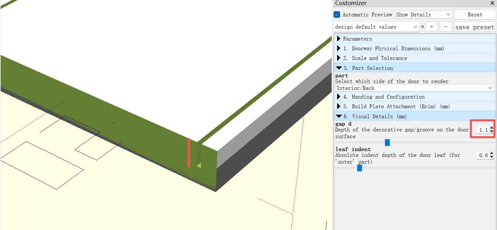|
    
    - **leaf_indent:** Adjusts the absolute indent depth of the door leaf (for the outer part).
        
    
    |   |   |
    |---|---|
    |leaf_indent=0.6|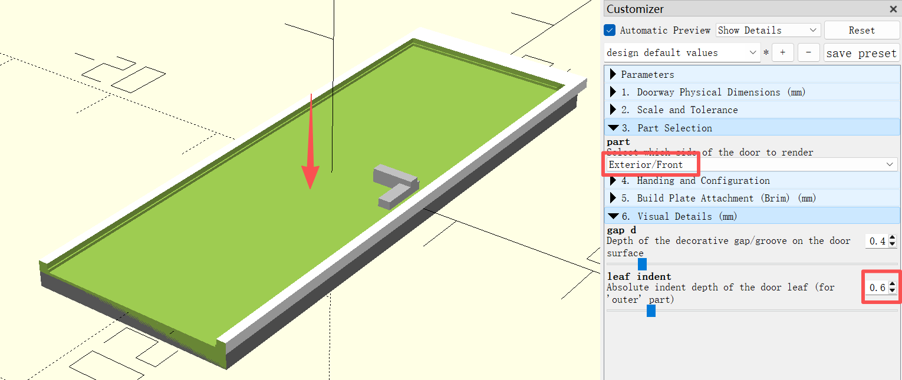|
    |leaf_indent=1.6|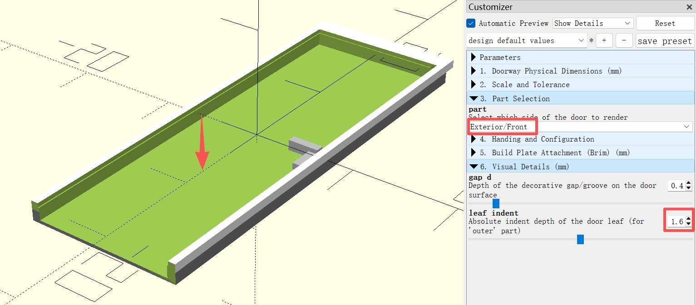|
    

# Windows

In `[3. Part Selection]`, you can select **Outer Frame**, **Inner Frame**, or **Glass Panel**.

|   |   |   |
|---|---|---|
|Outer Frame|Inner Frame|Glass Pannel|
|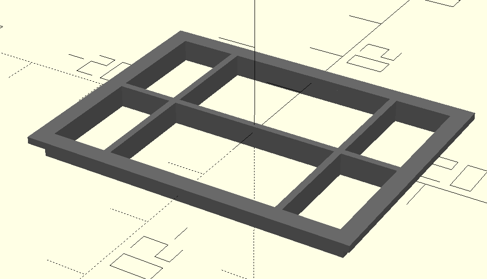|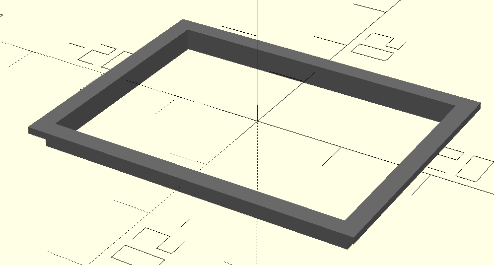|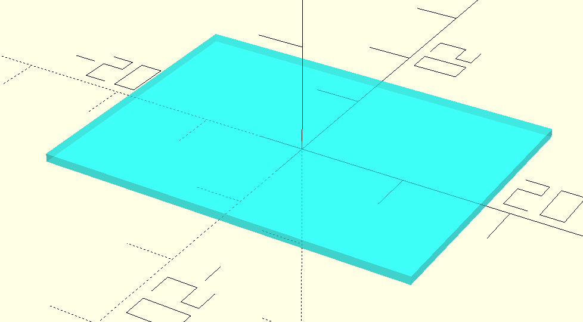|

These form a "sandwich" structure within the window opening.

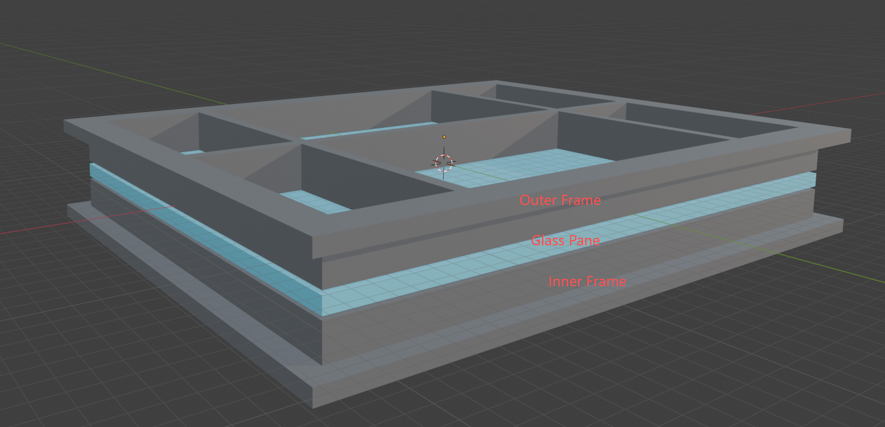

In practice, an **Outer Frame + Glass Panel** is often sufficient and stable (with glue). Adding the Inner Frame can sometimes create a "prison-like" aesthetic, especially with black filaments.

  

- **Dimension Settings**
    

The configuration for windows is similar to that of door openings; you need to accurately fill in these parameters to ensure the model fits perfectly into the window opening.

|   |   |
|---|---|
|Group|Parameter|
|1. Doorway Physical Dimensions (mm)]|`door_w`|
||`door_h`|
||`wall_t_real`|
|2. Scale and Tolerance|`scale_f`|
||`printer_tol`|

- **Brim** **Configuration**
    

The brim settings are also similar to the door module. You can customize their width and thickness (**b_w** & **b_t**), or remove the brim from any specific direction. Similarly, I recommend keeping all brims. If space is extremely limited, you should at least retain the **top and bottom** brims.

  

- Glass Thickness (`glass_t`)
    

Default is 0.8mm. This is ideal for achieving a uniform frosted glass effect using Transparent PETG (e.g., Bambu Lab brand).

  

- Mullion
    

Use `h_grids` and `v_grids` to add horizontal or vertical grids to the **Outer** **Frame**. This is recommended primarily for larger windows.

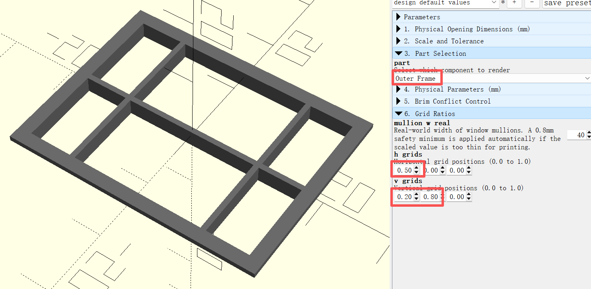
  

# **Cabinets**

This module allows you to create modern, minimalist cabinets with custom grid layouts using a coordinate-based array.

#### **Grid** **Mapping Rules (****`panel_map`****)**

The cabinet is defined by an array where you specify the behavior of each cell. **Crucially, the array is indexed starting from the bottom-left corner of the cabinet.**

- **`[span_x, span_y]`**: Creates a **Door** spanning X columns and Y rows.
    
- **`[span_x, span_y, 0]`**: Creates a **Hollow/Open** space.
    
- **`9`**: Acts as a **Placeholder** (use this to fill cells covered by a spanning door or hollow space).
    

**Example Structure:**

```JSON
[
  [[Row 1, Col 1], [Row 1, Col 2]], // Bottom Row
  [[Row 2, Col 1], [Row 2, Col 2]], // Second Row from bottom
  [[Row 3, Col 1], [Row 3, Col 2]]  // Top Row
]
```
#### **More Example Configurations**

> If you don't want to write the arrays yourself, you can send a reference image to an AI and provide mapping rules and these examples for context:

|                                                                                                                                                                                                                                                                                                                                                                                                                                                                                                                                                                                                      |                                                                                                                                                                                                                                                          |                                                                                                                                                                                                                                                          |
| ---------------------------------------------------------------------------------------------------------------------------------------------------------------------------------------------------------------------------------------------------------------------------------------------------------------------------------------------------------------------------------------------------------------------------------------------------------------------------------------------------------------------------------------------------------------------------------------------------- | -------------------------------------------------------------------------------------------------------------------------------------------------------------------------------------------------------------------------------------------------------- | -------------------------------------------------------------------------------------------------------------------------------------------------------------------------------------------------------------------------------------------------------- |
| panel_map                                                                                                                                                                                                                                                                                                                                                                                                                                                                                                                                                                                            | Model                                                                                                                                                                                                                                                    | 成品                                                                                                                                                                                                                                                       |
| // Standard side-by-side doors. <br>[ <br>    [[1,1],[1,1],[1,1],[1,1],[1,1]]<br>]                                                                                                                                                                                                                                                                                                                                                                                                                                                                                                                   |  |  |
| [ <br>// Row 1: The bottom-most section of the cabinet<br>    [[1, 1]], <br>	// Row 2: The section directly above the bottom row <br>	[[1, 1]], <br>]                                                                                                                                                                                                                                                                                                                                                                                                                                                |  |  |
| [ <br>    // Row 1: Two side-by-side doors at the bottom (Each 1 col wide, 4 rows high) <br>	[[1, 4], [1, 4]], <br>	// Rows 2-4: Placeholders for the height of the bottom doors <br>	9, 9, 9, <br>	// Row 5: A horizontal divider/door (Spans 2 columns, 1 row high) <br>	[[2, 1], 9], <br>	// Row 6: Another horizontal divider/door (Spans 2 columns, 1 row high)[cite: 1] <br>	[[2, 1], 9], <br>	// Row 7: A large hollow/open space (Spans 2 columns, 4 rows high)[cite: 1] <br>	[[2, 4, 0], 9], <br>	// Rows 8-10: Placeholders for the height of the hollow space[cite: 1] <br>	9, 9, 9 <br>] |  |  |
| [ <br>    [[1,4],[1,3],[1,3],[1,3]], <br>	9,9, <br>	[9,[1,4],[1,4],[1,4]], <br>	[[1,3],9,9,9], <br>	9,9, <br>	[[4,1],9,9,9] <br>]                                                                                                                                                                                                                                                                                                                                                                                                                                                                    |  | -                                                                                                                                                                                                                                                        |
| [ <br>    [[2,1],9,[1,3],[1,3]], <br>	[[2,1],9,9,9], <br>	[[2,1],9,9,9], <br>	[[4,6,0],9,9,9], <br>	9,9,9,9,9 <br>]                                                                                                                                                                                                                                                                                                                                                                                                                                                                                  |  |  |
| [ <br>    // Rows 1-11: Large hollow space (Washing machine slot) <br>	[[2, 11, 0], 9], 9, 9, 9, 9, 9, 9, 9, 9, 9, 9, <br>	// Row 12: Middle horizontal divider (Spans 2 columns, 1 row high) <br>	[[2, 1], 9], <br>	// Rows 13-18: Bottom vertical doors (Each door is 1 column wide, 4 rows high) <br>	[[1, 4], [1, 4]], <br>	9, 9, 9 <br>]                                                                                                                                                                                                                                                        |  |  |
| [ <br>    [[5,1],9,9,9,9], <br>	[[1,9],[1,9],[2,1],9,[1,9]], <br>	[9,9,[2,6,0],9,9], <br>	9,9,9,9,9, <br>	[9,9,[1,2],[1,2],9], <br>	9 <br>]                                                                                                                                                                                                                                                                                                                                                                                                                                                          |  |  |